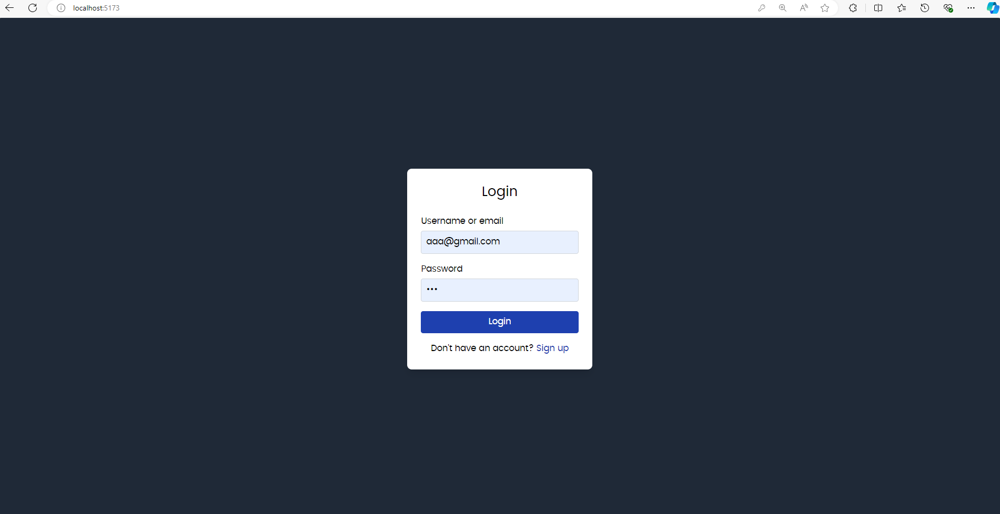

# OpenCode web

OpenCode web is an open source and local web editor.

Download also [opencode-back](https://github.com/javierhersan/opencode-back) and run it locally for full functionality (login and signup).

## Demo

1. Login.

2. Signup.

3. Editor.

4. Open a local folder.

5. Once opened, it will be available in your editor.

6. You can open files and start editing them.

7. You can save the files by clicking Ctrl+S or closing the tab.

8. You can also add new files and folders, rename them, or removing them.

9. You can rename the files by editing its name and losing the focus of the rename input.

10. You can move files and folders with drag and drop functionality.

## Credits

Feel free to use it but don't forget to mention us in your repo.

Happy coding!
